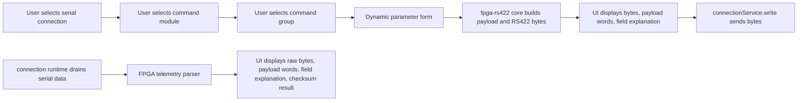

# FPGA RS422 Console Design

## 0. Direct Contract

Direct contract:

- `20260606待做任务/任务说明.md`
- 用户补充：
  - 本功能和 SCOE、集成化控制系统、northbound 无关。
  - 只是借用当前上位机软件，通过 RS422 串口给 FPGA 做指令下发和接收解析的 UI 操作。
  - 第一版支持参考文档里的全部模块、全部 group、全部参数。
  - 指令下发和数据解析区域右上角各有一个模块下拉栏，避免页面内容过多。
  - 下发结果同时显示最终字节流、payload words 和字段解释。

Boundary guards:

- `codestable/architecture/rewrite-target-structure.md`
- `codestable/quality/rewrite-quality-rules.md`
- `codestable/quality/rewrite-frontend-conventions.md`
- `codestable/quality/rewrite-frontend-checklist.md`
- `codestable/reference/rewrite-frontend-quickref.md`
- `20260606待做任务/参考文档/主机软件遥控遥测帧结构说明.md`
- `20260606待做任务/参考文档/应用层协议头与消息语义说明(1).md`
- `20260606待做任务/参考文档/应用层模块ID与遥测组说明(1).md`
- `20260606待做任务/参考文档/遥控指令清单/`
- `20260606待做任务/参考文档/主机指令具体执行/`
- `20260606待做任务/参考文档/遥测指令清单/`
- `20260606待做任务/参考文档/遥测状态具体执行/`

No corresponding long-term requirement exists yet. Acceptance can backfill a requirement after the feature shape is confirmed.

## 1. Decisions And Constraints

### 1.1 Placement

This feature is a new independent UI console in the rewrite app, not a SCOE tool and not a northbound/customer integration feature.

Owner placement:

- Protocol constants, catalog data, frame build, checksum, byte conversion, and telemetry parsing belong to a new feature domain under `rewrite/src/features/fpga-rs422/`.
- The route page belongs to `rewrite/src/pages/FpgaRs422ConsolePage.vue`.
- The app navigation and router get one new entry.
- Serial connection selection and transport write reuse the existing connection/platform chain.

This keeps the feature removable: deleting the page route/nav item and `features/fpga-rs422` removes the FPGA console without changing frame/send/task/SCOE/northbound behavior.

### 1.2 Explicit Non-Goals

- Do not wire this feature into SCOE.
- Do not wire this feature into northbound, result/report, or integrated-control-system APIs.
- Do not create task-system execution plans for FPGA commands in the first version.
- Do not reuse or mutate the generic frame asset list as the FPGA protocol source of truth.
- Do not infer missing protocol values from names if the supplied reference docs do not contain them.
- Do not claim real FPGA hardware validation from static tests.

### 1.3 Complexity

Lane B: Single-thread disciplined feature.

Reason: the request is one page and one protocol domain, but it crosses UI, protocol calculation, all supplied catalog data, serial write/read integration, and validation fixtures. It is too large for fastforward and does not need a roadmap because it is still one independently accepted capability.

## 2. Design

### 2.1 Noun Layer

Current state:

- The rewrite app already has feature domains for `connection`, `receive`, `send`, `task`, and `display`.
- `connection` exposes serial/network connection summaries and write operations through a platform adapter.
- `send` currently builds from generic frame assets; it is not a natural owner for this FPGA application-layer catalog because the protocol source is the supplied module/group/parameter tables, not user-maintained frame definitions.
- The supplied FPGA protocol has two layers:
  - RS422 fixed frame: `frame_header`, `payload_length_bytes`, payload words, checksum.
  - Application payload: `header word0` plus command parameter words or telemetry data words.

Changes:

Add a catalog and protocol model under `features/fpga-rs422`:

```ts
type FpgaRs422ModuleId = 0x0 | 0x1 | 0x2 | 0x3 | 0x4 | 0x5 | 0x6 | 0x7 | 0x8;

interface FpgaRs422ModuleCatalog {
  readonly key: string;
  readonly label: string;
  readonly moduleId: FpgaRs422ModuleId;
  readonly commandGroups: readonly FpgaCommandGroupDef[];
  readonly telemetryGroups: readonly FpgaTelemetryGroupDef[];
}

interface FpgaCommandGroupDef {
  readonly key: string;
  readonly label: string;
  readonly groupId: number;
  readonly params: readonly FpgaCommandParamDef[];
}

interface FpgaCommandParamDef {
  readonly key: string;
  readonly label: string;
  readonly paramId: number;
  readonly kind: 'value' | 'map' | 'pulse' | 'stream';
  readonly wordCount: number;
  readonly bitWidth: number;
  readonly defaultValue?: number;
  readonly optionCount?: number;
}

interface FpgaTelemetryGroupDef {
  readonly key: 'runtime' | 'cfg';
  readonly label: string;
  readonly groupId: 0x80 | 0x81;
  readonly fields: readonly FpgaTelemetryFieldDef[];
}

interface FpgaTelemetryFieldDef {
  readonly wordIndex: number;
  readonly key: string;
  readonly label: string;
  readonly sourceExpression: string;
  readonly bitWidth: number;
}
```

Build output must be inspectable:

```ts
interface FpgaCommandBuildResult {
  readonly frameWords: readonly number[];
  readonly payloadWords: readonly number[];
  readonly bytes: readonly number[];
  readonly checksum: number;
  readonly explanations: {
    readonly header: readonly FpgaHeaderFieldExplanation[];
    readonly params: readonly FpgaParamExplanation[];
  };
}
```

Telemetry parse output must also be inspectable:

```ts
interface FpgaTelemetryParseResult {
  readonly valid: boolean;
  readonly frameWords: readonly number[];
  readonly payloadWords: readonly number[];
  readonly checksumExpected: number;
  readonly checksumActual: number;
  readonly moduleKey?: string;
  readonly groupKey?: string;
  readonly fields: readonly FpgaTelemetryFieldExplanation[];
  readonly issues: readonly string[];
}
```

Catalog source:

- Module IDs come from `遥控指令清单/README.md` and `应用层模块ID与遥测组说明(1).md`.
- Command group IDs come from `主机指令具体执行/*.md`, because those files list `group_id` per group and provide default full-frame examples.
- Command parameters come from `遥控指令清单/*.md`.
- Telemetry group IDs and field definitions come from `遥测指令清单/*.md` and `遥测状态具体执行/*.md`.

### 2.2 Orchestration Layer

Main flow:



Current state:

- `AppShell.vue` owns navigation items.
- `routes.ts` owns route registration.
- `ConnectionPage.vue` shows existing connection creation and connection lifecycle.
- `connectionService.write()` can send bytes to a selected serial connection.
- `routingTick()` currently drains connection data events into generic receive processing. This is useful evidence but not sufficient for FPGA-specific parsing because generic receive depends on frame assets.

Changes:

- Add one page with two panels:
  - Left panel: "指令下发".
  - Right panel: "数据解析".
  - Bottom or lower section: latest send result with final bytes, payload words, field explanation.
- Each panel has its own module selector at the upper-right:
  - Command module selector filters command groups and command params.
  - Telemetry module selector filters parsed telemetry display to the selected module; an "all modules" option can be available only if it does not obscure the required per-module selector.
- The page uses existing connection summaries to select the RS422 serial target.
- Command send calls a feature service/composable, which builds bytes through pure core and writes through `connectionService.write()`.
- Telemetry display consumes recent data events or a dedicated page-facing polling reader. If the existing runtime route only feeds generic receive, implementation must add a page-safe bridge that exposes recent raw serial bytes without moving parse logic into the page.

### 2.3 Mount Points

Removing these mount points should remove the feature:

- `rewrite/src/router/routes.ts`: route `/fpga-rs422`.
- `rewrite/src/app/AppShell.vue`: navigation item "FPGA 指令解析".
- `rewrite/src/pages/FpgaRs422ConsolePage.vue`: route page.
- `rewrite/src/features/fpga-rs422/`: catalog, core, services/composables/components, fixtures/tests.
- Optional runtime/page bridge for raw serial data access if needed by telemetry parsing.

### 2.4 Implementation Strategy

Step 1: Catalog data and protocol core.

- Encode the supplied module/group/param/telemetry catalog as TypeScript constants.
- Add pure functions for header word packing, checksum, word-to-byte conversion, byte-to-word parsing, command build, and telemetry parse.
- Use examples in `主机指令具体执行/*.md` as golden fixtures.

Step 2: Feature service and UI-facing composable.

- Provide a service that receives selected connection, module, group, and param values; returns build result; writes bytes through connection service.
- Provide selectors/helpers for module options, group options, default param values, and display rows.

Step 3: Page shell and navigation.

- Add route and sidebar entry.
- Build the single page with left command panel, right telemetry panel, and lower trace display.
- Use Quasar components, `useAsyncAction`, `usePolling`, and `useNotify`.

Step 4: Telemetry ingest and parse display.

- Parse incoming RS422 frames into telemetry results.
- Show checksum state, module/group, raw bytes, payload words, and field explanations.
- Preserve recent parsed telemetry in a bounded list to avoid unbounded UI growth.

Step 5: Verification.

- Run unit tests for golden command frames and telemetry parsing.
- Run static scans for UI hard-coded visual values touched by this feature.
- Run `pnpm -C rewrite lint` and `pnpm -C rewrite build` after implementation.
- Mark real RS422/FPGA behavior as hardware validation until tested with the target board.

### 2.5 Structure Health And Micro-Refactor

Current state:

- `AppShell.vue` navigation is small; adding one nav item is acceptable.
- `routes.ts` is small; adding one route is acceptable.
- Existing `SendPage.vue` is already substantial, but this feature should not add to it.
- Existing generic `send` and `receive` are not ideal owners because this is a fixed FPGA protocol catalog and UI console, not a generic frame asset workflow.

Decision:

- No pre-feature micro-refactor.
- New logic defaults to new files under `features/fpga-rs422` and a new page.
- Do not expand `SendPage.vue`, `ReceivePage`, generic `send/core`, or generic `receive/core` for this feature unless implementation finds a small shared helper that is truly protocol-agnostic.

Out-of-scope observation:

- The existing runtime currently routes connection data into generic receive. If page-safe raw byte access is not already available, implementation may need a narrow bridge. That bridge must only expose transport facts/raw data to this feature; it must not move FPGA parse rules into runtime.

## 3. Acceptance Contract

Normal scenarios:

- User opens the sidebar entry and sees a single FPGA RS422 console page.
- In the command panel, selecting any supplied module shows that module's command groups and parameters.
- Selecting a group and entering values builds a valid RS422 fixed frame.
- Build result shows:
  - final byte stream,
  - payload words,
  - header field explanation,
  - per-parameter explanation.
- Sending writes the final bytes to the selected serial connection through existing connection/platform APIs.
- In the parse panel, selecting a module limits telemetry display to that module.
- Incoming telemetry frame parse result shows:
  - raw bytes,
  - payload words,
  - checksum pass/fail,
  - module/group,
  - per-field explanation.

Boundary scenarios:

- Pulse commands with zero payload data words build a payload containing only the header word.
- Multi-parameter groups build `param_count` as parameter count, not data word count.
- Telemetry `param_count` is interpreted as telemetry data word count, not parameter count.
- Payload length is always `(1 + payloadDataWordCount) * 4` for command frames and `(1 + telemetryWordCount) * 4` for telemetry frames.
- 32-bit words are emitted and parsed in high-byte-first order.
- Checksum is a 32-bit natural-wrap sum of frame header, payload length, and payload words.

Error scenarios:

- No serial connection selected: send is disabled or reports a clear error.
- Disconnected target: send fails through connection service outcome and displays a clear error.
- Input value exceeds declared bit width: build fails before write and explains the offending parameter.
- Unknown module/group in telemetry: parser keeps raw bytes/payload words and reports an unknown catalog issue.
- Bad checksum: parser displays expected vs actual checksum and does not mark frame valid.
- Incomplete or non-4-byte-aligned frame bytes: parser reports an issue and keeps raw bytes visible.

Explicit non-goal checks:

- No SCOE imports or command-ingress coupling.
- No northbound/result/report coupling.
- No renderer direct `serialport`, `fs`, `ipcRenderer`, or Node access.
- No task system dependency for first-version command sends.

Validation levels:

- Static/Vitest: protocol core, golden command fixtures, telemetry parser, selectors/helpers.
- Manual UI checklist: page layout, module selectors, dynamic forms, send trace display, telemetry trace display.
- Hardware validation: actual RS422 send/receive with FPGA board.

## 4. Architecture And Documentation Follow-Up

If approved and implemented, acceptance should consider:

- Backfill a requirement for "FPGA RS422 command and telemetry console".
- Add architecture note only if a new raw serial data bridge is introduced.
- Keep supplied reference docs as external reference material; do not rewrite them into long-term schema without implementation evidence.

## 5. Open Questions

These do not block design, but implementation must handle them explicitly:

- Some command parameter docs list option counts but not full option label/value tables. When options are not available, UI should use numeric inputs constrained by bit width rather than invent labels.
- Some fields are marked "未标注中文名"; UI should display the raw field key with that label rather than inventing names.
- The first version should use the supplied `主机指令具体执行` examples as golden fixtures. If an example conflicts with the formula in `主机软件遥控遥测帧结构说明.md`, implementation must stop and report the conflict.
